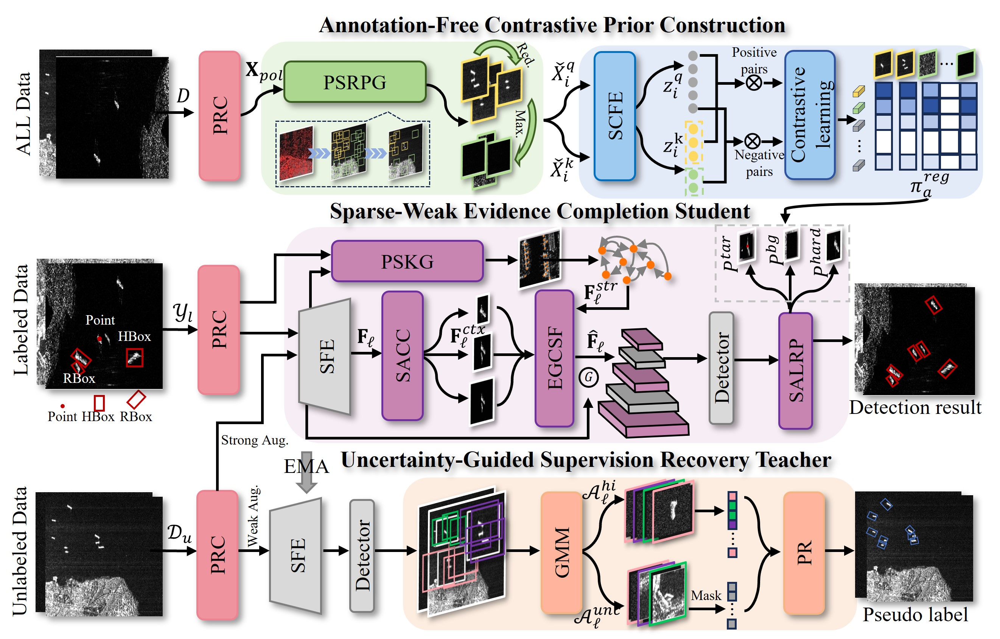

# SWS-TER: Sparse Weakly Semi-supervised Tri-Evidence Recovery

PyTorch implementation of **"Sparse Weakly Semi-supervised Tri-Evidence
Recovery Network for Oriented Ship Detection in PolSAR Imagery."** SWS-TER is
built on MMDetection and MMRotate and targets sparse, mixed-form supervision
for oriented ship detection in PolSAR imagery.



## What is implemented

- **ACPC (Stage I):** polarimetric superpixels, revised Wishart saliency,
  region/background separability, four region anchors, diversity sampling,
  momentum SCFE, InfoNCE queue, prototype similarities and continuous
  `P_tar/P_bg/P_hard` priors.
- **SWCS (Stages II-III):** scale-adaptive context compensation (SACC),
  prior-guided scattering keypoint graph (PSKG), GraphSAGE reasoning and
  evidence-guided context-scattering fusion (EGCSF).
- **SALRP:** ACPC-modulated sparse focal loss using Eq. (32), assigned by exact
  superpixel ownership and applied only to high-confidence negative FCOS
  locations in Eq. (33).
- **UGSRT:** per-FPN-level two-component GMM, explicit teacher-student
  consistency, high/uncertain/low candidate partitioning, latent-feature mask
  tokens, online class prototypes and a lightweight ViT reconstructor.
- **Mixed weak annotations:** RBox, HBox and Point supervision with center,
  superpixel/Voronoi, overlap and SAR edge-alignment constraints.

The custom modules live under `projects/SWS_TER`, while the bundled legacy
`mmdet`, `mmrotate` and `semi_mmrotate` packages provide the end-to-end
training path. The repository is organized into `configs`, `docs`, `projects`,
`requirements`, `resources`, `tests` and `tools`.

## Installation

The tested compatibility path is Python 3.9, PyTorch 1.13.1,
CUDA 11.6 and `mmcv-full` 1.7.1:

```bash
conda env create -f requirements/environment-legacy.yml
conda activate sws-ter-legacy
```

`requirements/paper.txt` records the environment used for the paper. The
legacy environment remains the tested end-to-end path for this codebase; see
`docs/REPRODUCIBILITY.md` for compatibility notes.

## Dataset

The dataset used in this work is publicly available for benchmarking and
reproducibility.

**Download:** [Google Drive](https://drive.google.com/drive/folders/10dqewpIj7hA5NvQ7XihiB9I73-Kkzptb?usp=sharing)

## Data and Stage I priors

The network path accepts ordinary single-channel SAR tiles. They are kept
single-channel for SAR evidence computation and replicated only at the
ImageNet-pretrained ResNet stem.

The released OSPAN configuration reads its root from `SWS_TER_DATA_ROOT`.
For a prepared 20%-image/20%-instance split:

```powershell
$env:SWS_TER_DATA_ROOT = 'D:\datasets\ospan'
python tools/verify_ospan_data.py --data-root $env:SWS_TER_DATA_ROOT
```

To rebuild the split from Pascal VOC XML files instead:

```bash
python tools/prepare_gr_dataset.py \
  --images data/raw/sar_gray --annotations data/raw/Annotations \
  --out-dir data/ospan_sws_ter --seed 42
```

Run the annotation-free ACPC stage on **all** training images:

```bash
python tools/acpc/run_acpc.py \
  --xpol-dirs "$env:SWS_TER_DATA_ROOT/semi_ratio_20/sparse_ratio_20/label_image" \
              "$env:SWS_TER_DATA_ROOT/semi_ratio_20/sparse_ratio_20/unlabel_image" \
  --work-dir work_dirs/acpc --epochs 20 --device cuda
```

The final file `work_dirs/acpc/acpc_priors.json` is consumed directly by the
student head and PSKG support map. Optional paper-side polarimetric preparation
utilities (`prepare_xpol.py`, `prepare_covariance.py`, and
`--covariance-dirs`) are retained for ablation studies, but are not required
by the single-channel network path.

## Train and evaluate

The primary 20%-images / 20%-instances RBox setting is:

```bash
python tools/train.py configs/sws_ter/sws_ter_ospan_hbox_20_20.py \
  --work-dir work_dirs/sws_ter_ospan_hbox_20_20

python tools/test.py configs/sws_ter/sws_ter_ospan_hbox_20_20.py \
  work_dirs/sws_ter_ospan_hbox_20_20/latest.pth --eval mAP
```

The published schedule is encoded in the config: 48,000 iterations, batch
size 4, 12,800 burn-in iterations, 800 x 800 inputs, Adam at `5e-5`, weight
decay `0.05`, linear warm-up and gradient clipping at norm 35. Inference uses
the student branch.

## Verification

Core components have CPU-only unit tests and do not require MMCV CUDA ops:

```bash
pytest -q tests/test_core_modules.py
python -m compileall projects tools configs
```

The framework-level smoke test requires the compiled legacy `mmcv-full`, but
does not require dataset files or a checkpoint:

```bash
python tests/framework_smoke.py
```

It builds the full model and checks the single-channel forward path, UGSRT,
Eq. (32) superpixel mapping, Eq. (33) gating, configured center-loss weight,
student inference and model parameter counts.

## Documentation

- `docs/METHOD_TO_CODE.md` - equation-by-equation implementation map.
- `docs/REPRODUCIBILITY.md` - settings, seeds and implementation choices.
- `docs/DATA.md` - directory layout and annotation encoding.
- `docs/RUN_OSPAN.md` - complete PowerShell commands for every stage.

## License and attribution

SWS-TER is released under Apache-2.0. Bundled OpenMMLab-derived code
retains its original Apache-2.0 notices under `licenses/`. Third-party code
attribution is recorded in `NOTICE`.
